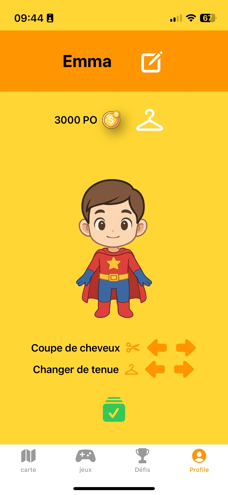

# La programation réactive.

La réactivité, c’est la capacité d’un système (site, application, interface) à réagir automatiquement et immédiatement à un changement, sans action supplémentaire de l’utilisateur.

Ce changement peut venir :

-de l’utilisateur (clic, saisie clavier, scroll…)

-du système (données reçues, timer, API, état interne)

-du réseau (réponse serveur, erreur, chargement terminé)

 **Point clé** :

L’interface se met à jour parce que l’état change, pas parce qu’on lui dit explicitement de se rafraîchir.

exemple : quand vous faites une recherche google les propositions s'actualisent en temps réel lorsque vous rentrez du texte.


## Reactive  ≠ Rapide

Il ne faut pas confondre un système rapide avec un système réactive ce n'est pas la même chose. Un programme, une interface peut être rapide sans pour autant être réactive, un petit exemple pour bien saisir la différence :


On peut courir vite et ne pas etre reactive ici le bonhomme court mais marque une pause avant de sauté car il **n'a pas anticipé** l'obstacle donc il s'arrete pour **reflechir** à comment reagir a cette nouvelle information puis il saute.


Maintenant on peut voir que le bonhomme court sans interruptions et **réagies immédiatement** face au rocher sans avoir besoin de **s'arrêter pour réfléchir**.

c'est la différence entre rapide et réactive, être rapide ne signifie pas savoir faire face au problème rencontré et y réagir en conséquence de manière immédiate.

Pour une application,un jeu ou autre ne pas être réactive c'est ne pas réagir en temps réel aux actions de l'utilisateur ou l'arrivée d'une nouvelle donnée.Si votre programme a besoin de s'actualiser en permanence dès qu'il reçoit une nouvelle information il n'est pas réactif même s'il le fait rapidement.

## Exemple d'interface reactive

Il y a plusieurs façons de rendre un programme (site app etc) réactive:

-L'Architecture orientée événements(Event-driven architecture): le système réagit à un événement ; click, scroll, saisie clavier,nouveau message.

-Programmation réactive (Reactive programming): les données sont observées , quand elles changent tout ce qui en dépend se met à jour automatiquement sans que l’interface s’actualise.

-Architecture basée sur le flux de données (data streams/flux): les données arrivent en continu pas en une seule fois,l’app ne demande pas les données elle les reçoit

Pour vous expliquer un peu le système de données observé et de réaction lié à un  événement voici un cas concréé:


Ici l'interface profil d'un jeu que j'ai fait avec swift qu'on apelle view. Il s'agit de l'interface avant modfication.

Le personnage que vous voyez et les le nom mofiable en haut sont dans une Class :

```swift
import Foundation
import Observation

@Observable class User {
    var selectedOutfit : String = ""
           var selectedHair : String = "coupeM1"
    var username = "Ton prenom"
    var avatar : Avatar = Avatar (
        hairs: ["coupeM1","coupeM2","coupeM3","coupeM4","coupeM5","coupeF1","coupeF2","coupeF3","coupeF4","coupeF5"], body: "char", outfits: ["","chevalier","aventurier","dress","hero"])
```
Cette class reprend ma classe avatar qui se trouve autre par et le nom d'user "ton prenom" par defaut dans la zone de text modifiable.
`@observable` indique que la classe user est ce qu'il faut observé

passon du coter de la view 

``` swift
    @Bindable var data = User()
```
ici je dit a ma vue de se lié a mon observable "user" pourquoi car dans cette page j'ai des element qui vont modifié User et je veut que user soit changer en temps réel dans tout mes fichier observé (dans toute mes page qui apelle un elemenet de User)



Voici l'edit view c'est ce qu s'affiche apres avoir cliqué sur le ceintre pour modifié le personnage on peut voir des bouton pour changer la tenu.
```swift
Button {
    hairsIndex = (hairsIndex + 1) % data.avatar.hairs.count
}
```
Ici rien de bien compliqué mon bouton recupere les donnée "observé" dans user qui vienne d'avatar souvenez vous on avait 

```swift
 var avatar : Avatar = Avatar (
        hairs: ["coupeM1","coupeM2","coupeM3","coupeM4","coupeM5","coupeF1","coupeF2","coupeF3","coupeF4","coupeF5"]
```
bon bouton a recupére cette liste grace a @bindable et @observable et juste la parcourire en fesant d'effilé les tenu snas jamais rechargé la page.
c'est de la reactivé en reaction a un evenement ici le click mais aussi par observation.

## En conclusion 

Il existe plusieurs façons de rendre une application ou une interface réactive.
Cela peut passer par l’observation de l’état (comme en SwiftUI), mais aussi par
d’autres sources de données comme les WebSockets pour le temps réel, les APIs
(météo, suivi de commandes), ou encore les capteurs des téléphones comme le GPS.

Dans tous les cas, le principe reste le même : lorsque les données changent,
l’interface se met à jour automatiquement, sans rechargement manuel.


